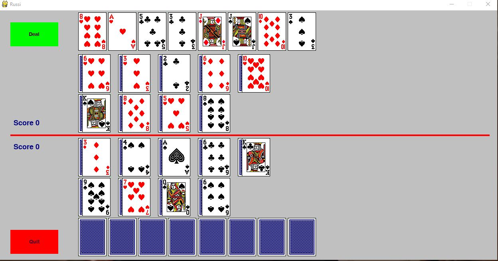

# russi

## To run the game
First in the files server.py and network.py both players need to change the server address to the address associated to the network. The players can find the address by opening Command Prompt, type in ipconfig and take the number for IPv4 Address.

One of the player runs server.py. Then both players run client.py. Then you have the user interface up.

Following that, one of the players pushes the Deal button and the game starts. To put out a card, the player simply pushes the card, it's that simple!

## How the game works
The card game Russi is a game I like playing a lot with my parents. It is simple but very strategic. Each player gets 8 cards on each end and can't show the other player. Then each player get's 18 cards on the table, 9 of the turn up and 9 turn down. The red line in the middle seperates player 0 from player 1. See pictures below. The picture above is the perspective of player 0 and the picture below is the perspective of player 1.

Each player picks a card and puts it out. If player 0 puts out first and puts out a heart of Ace, player 1 has to put out a heart as well. If player 1 puts out heart higher than 10, then player 1 gets a point. If he puts lower, or if he puts a card of another sort, in case he doesn't have an heart, player 0 gets a point. In this case the pair goes up where player 0 is. In this game you can see the last pair. As soon as there is a new pair then the old pair get's deleted and can't be looked on again. First picture below shows when the first card has been dealt. The second photo shows when the second pair has been dealt, when player 0 wins. The third picture shows when player 1 has dealt his first card. The fourth picture shows when the second pair has been dealt and player 1 has won. The fifth picture below shows when player two puts his first card out, since he won previously and the sixth picture shows the pair when player 1 won again and the score is 2-1 for player 1.

Finally, if player 0 wins the pairs he gets to do next. In the next round, if player 1 tries to put out a card, he gets a highlight telling him it's not his turn. Furthermore, if player 1 tries to put out a different sort as player 0, while he still in fact has that sort on his hand or outside turning up, he gets a highlight telling him he needs to deal out the same sorts.
